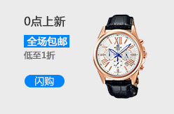
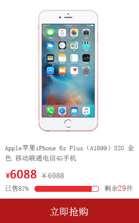

## 字体图标

A：怎么运用字体图标？

> Q：1.下载（https://icomoon.io/app/#/select）
>
> 2.下载的文件中，我们主要应用:style.css和fonts，打开style.css这个文件,选择如下所示的代码进行复制粘贴至自己的css样式中:
>
> 
>
> > 谨记:路径一定要选择正确,根据自己的文件位置进行选择路径!!!
>
> ~~~html
> <body>
>     <ul>
>           <li>
>             <a href="#">我的订单</a>
>           </li>
>           <li></li>
>           <li>
>             <a href="#" class="arrow_icon">我的品优购</a>
>           </li>
>     </ul>
> </body>
> ~~~
>
> css样式中对要显示的那个标签进行设置字体名称:font-family:
>
> ~~~css
> @font-face {
>   font-family: 'icomoon';
>   src:  url('../fonts/icomoon.eot?hl2lt3');
>   src:  url('../fonts/icomoon.eot?hl2lt3#iefix') format('embedded-opentype'),
>     url('../fonts/icomoon.ttf?hl2lt3') format('truetype'),
>     url('../fonts/icomoon.woff?hl2lt3') format('woff'),
>     url('../fonts/icomoon.svg?hl2lt3#icomoon') format('svg');
>   font-weight: normal;
>   font-style: normal;
>   font-display: block;
> }
> .arrow_icon::after{
>     content: "\ea43"; //字体图标代号
>     font-family: "icomoon";
>     margin-left: 6px;
> }
> ~~~
>
> 

## 块状元素/内联元素/内联块元素

常用的块状元素有：（独占一行，其他元素会被其挤到下一行）

> 
、
、<h1>...<h6>、<ol>、<ul>、<dl>、<table>、<address>、<blockquote> （块引用）、<form>
>

常用的内联元素有：（内容多少，宽度就多少，设置竖直方向的margin和padding是不起效果的）

> <a>、、<i>、<em>、<strong>、<label>、<q>、<var>、<cite>、<code>、 
>

常用的内联块状元素有：

> 、<input> 图片是内联元素，同时是替换元素，替换元素是可以设置宽高的。
>

## 超出文字用省略号显示

~~~html
 

            <ul>
              <li><a href="#"><strong>[热评]</strong>超高贴合放肆运动，上手Jabra真无线耳机</a></li>
              <li><a href="#"><strong>[HOT]</strong>国货之光电动牙刷篇，用心打造牙齿守护神</a></li>
              <li><a href=""><strong>[热门]</strong>阿芙神采美目复方油——紧实淡纹小熨斗</a></li>
              <li><a href=""><strong>[热评]</strong>施华洛世奇，精美的</a></li>
              <li><a href="#"><strong>[热评]</strong>超高贴合放肆运动，上手Jabra真无线耳机</a></li>
            </ul>
          

~~~

~~~css
.news-bd ul li {
  height: 24px;
  line-height: 24px;
  /* 超出部分的文字不显示 */
  overflow: hidden;
  /* 限制文字只能在一行排列 */
  white-space: nowrap;
  /* 超出部分的文字用省略号代替显示 */
  text-overflow: ellipsis;
}
~~~

效果：

## 字体图标位置

~~~html
 

          <ul>
            <li>
                <i></i>
                
话费

            </li>
            <li>
                <i></i>
                
飞机

            </li>
            <li>
                <i></i>
                
话费

            </li>
            <li>
                <i></i>
                
飞机

            </li>
            <li>
                <i></i>
                
话费

            </li>
            <li>
                <i></i>
                
飞机

            </li>
            <li>
                <i></i>
                
话费

            </li>
            <li>
                <i></i>
                
飞机

            </li>
            <li>
                <i></i>
                
话费

            </li>
            <li>
                <i></i>
                
飞机

            </li>
            <li>
                <i></i>
                
话费

            </li>
            <li>
                <i></i>
                
飞机

            </li>

        </ul>
        

~~~

~~~css
.lifeservice {
  /* 250/4 == 62.5 */
  /* 四个63px宽度的li会超过总宽度 */
  /* 第四个li的边框会超出lifeservice的边框 */
  /* 采用overflow消除这种影响 */
  overflow: hidden;
  height: 209px;
  border: 1px solid #e4e4e4;
  border-top: 0;
}
.lifeservice ul {
  width: 252px;
}
.lifeservice ul li {
  float: left;
  width: 63px;
  height: 71px;
  border-right: 1px solid #e4e4e4;
  border-bottom: 1px solid #e4e4e4;
  text-align: center;
}
.lifeservice ul li i {
  display: inline-block;
  width: 24px;
  height: 28px;
  background-color: pink;
  margin-top: 12px;
}
.lifeservice ul li:nth-child(1) i {
  background: url('../images/icons.png') no-repeat -19px -14px;  //相当于坐标轴的第四象限的坐标
}
.lifeservice ul li:nth-child(2) i {
  background: url('../images/icons.png') no-repeat -78px -14px;
}
~~~

效果：

## 推荐模块竖线

~~~html

      <ul>
        <li></li>
        <li></li>
        <li></li>
        <li></li>
      </ul>
    

~~~

~~~css
.recom_bd {
  float: left;
}
.recom_bd ul li {
  position: relative;
  float: left;
}
.recom_bd ul li img {
  width: 248px;
  height: 163px;
}
.recom_bd ul li:nth-child(-n+3)::after {
  content: '';
  position: absolute;  //定位right为0
  right: 0;
  top: 10px;
  width: 1px;  //竖线的宽高
  height: 145px;
  background-color: #dddddd;
}
~~~

效果：

## 给li加框

~~~html

        <ul class="clearfix">
            <li></li>
            <li></li>
            <li></li>
            <li></li>
            <li></li>
            <li></li>
            <li></li>
            <li></li>
            <li></li>
            <li></li>
            <li></li>
            <li></li>
        </ul>
    

~~~

~~~css
.sk_bd ul li {
  /* 防止图片超出li盒子的大小 */
  overflow: hidden;
  float: left;
  margin-right: 13px;
  text-align: center;
  width: 290px;
  height: 460px;
  /* 如果li本身没有边框，鼠标经过会多一个边框，势必会影响图片大小 */
  /* 最明显的影响是鼠标经过图片时会有一个小小的抖动 */
  /* 消除该影响的办法可以是最开始就给li添加一个透明边框 */
  border: 1px solid transparent;
}
.sk_bd ul li:nth-child(4n) {
  margin-right: 0;
}
.sk_bd ul li:hover {
  /* 如果li本身没有边框，鼠标经过会多一个边框，势必会影响图片大小 */
  /* 最明显的影响是鼠标经过图片时会有一个小小的抖动 */
  /* 消除该影响的办法可以是最开始就给li添加一个透明边框 */
  border: 1px solid #c81523;
}
~~~

效果：

## 电梯导航

~~~html

    <ul>
        <li class="current">家用电器</li>
        <li>手机通讯</li>
        <li>电脑办公</li>
        <li>精品家具</li>
    </ul>
  

~~~

~~~css
.fixedtool {
  position: fixed;
  top: 100px;
  /* 先是走浏览器宽度一半，再走版心宽度一半（600px）+自身宽度(66px)+空隙宽度(10px) */
  left: 50%;
  margin-left: -676px;  
  width: 66px;
  background-color: #fff;
}
.fixedtool ul li {
  height: 32px;
  line-height: 32px;
  text-align: center;
  font-size: 12px;
  border-bottom: 1px solid #ccc;
  cursor: pointer;
}
.fixedtool .current {
  background-color: #c81623;
  color: #fff;
}
~~~

效果：

导入jQuery的js(jquery.min.js),

~~~js
$(function () {
    // 当我们点击了小li 此时不需要执行 页面滚动事件里面的 li 的背景选择 添加 current
    // 节流阀  互斥锁 
    var flag = true;
    // 1.显示隐藏电梯导航
    var toolTop = $(".recom").offset().top;
    toggleTool();
    function toggleTool() {
        if ($(document).scrollTop() >= toolTop) {
            $(".fixedtool").fadeIn();  //淡入效果 
        } else {
            $(".fixedtool").fadeOut();  //淡出效果
        };
    }
    $(window).scroll(function () {
        toggleTool();
        // 3. 页面滚动到某个内容区域，左侧电梯导航小li相应添加和删除current类名
        if (flag) {
            $(".floor .w").each(function (i, ele) {
                if ($(document).scrollTop() >= $(ele).offset().top) {
                    console.log(i);
                    $(".fixedtool li").eq(i).addClass("current").siblings().removeClass();
 
                }
            })
        }
    });
    // 2. 点击电梯导航页面可以滚动到相应内容区域
    $(".fixedtool li").click(function () {
        flag = false;
        console.log($(this).index());
        // 当我们每次点击小li 就需要计算出页面要去往的位置 
        // 选出对应索引号的内容区的盒子 计算它的.offset().top
        var current = $(".floor .w").eq($(this).index()).offset().top;
        // 页面动画滚动效果
        $("body, html").stop().animate({
            scrollTop: current + 1
        }, function () {
            flag = true;
        });
        // 点击之后，让当前的小li 添加current 类名 ，姐妹移除current类名
        $(this).addClass("current").siblings().removeClass();
    })
})
~~~

## 轮播图

### 缓动动画

~~~javascript
//缓动动画封装 obj目标对象   target目标位置
function animate(obj, target, callback){
    //先清除以前的定时器，只保留当前的一个定时器执行
    clearInterval(obj.timer)
    obj.timer = setInterval(function(){
        //步长值写在定时器里面
        let step = (target - obj.offsetLeft) / 10
        //Math.ceil向上取整 ， Math.floor向下取整
        step = step > 0 ? Math.ceil(step) : Math.floor(step)
        if(obj.offsetLeft === target){
            //停止动画 本质是停止定时器
        	clearInterval(obj.timer)
             // 回调函数写到定时器结束里面
            // if (callback) {
            //     // 调用函数
            //     callback();
            // }
            callback && callback()
            // 左侧有参数传进来嘛? 结果为true, 再执行右边,调用回调函数(短路运算符),为假直接跳过
     }
		obj.style.left = obj.offsetLeft + step + 'px'
     },15)
}
~~~

### banner

~~~html

      

        <a href="javascript:;" class="arrow-l"> &lt; </a>  //href的#改，否则会返回顶部
        <a href="javascript:;" class="arrow-r"> &gt; </a>
        <ul>
          <li>
            
          </li>
          <li>
            
          </li>
          <li>
            
          </li>
          <li>
            
          </li>
        </ul>

        <ol class="circle">
          <!-- <li></li>
          <li class="current"></li>
          <li></li>
          <li></li>
          <li></li>
          <li></li>
          <li></li>
          <li></li> -->
        </ol>
      

~~~

~~~css
.main {
  overflow: hidden;
  height: 455px;
  padding-left: 220px;
  padding-top: 10px;
}
.main .focus {
  position: relative;
  top: 0;
  left: 0;
  /*给父盒子加溢出隐藏*/
  overflow: hidden;
  height: 455px;
  width: 721px;
}
.focus ul {
  /* 使用动画animate函数的前提，该元素必须有定位 */
  position: absolute;
  top: 0;
  left: 0;
  width: 600%; //4张图片只要大于400%就好，使其在一行排列
}
.focus ul li {
  float: left;
}
.arrow-l,
.arrow-r {
  display: none;
  position: absolute;
  /*加了绝对定位的盒子可以直接设置高度和宽度*/
  top: 50%;
  margin-top: -20px;
  width: 24px;
  height: 40px;
  background-color: rgba(0,0,0, .3);
  text-align: center;
  line-height: 40px;
  color: #fff;
  font-family: 'icomoon';
  font-size: 18px;
  z-index: 2;
}
.arrow-r {
  right: 0;
}
/*小圆圈*/
 .circle {
  	position: absolute;
  	bottom: 10px;
  	left: 50px;
  }
  .circle li {
  	float: left;
  	width: 8px;
  	height: 8px;
  	/*background-color: #fff;*/
  	border: 2px solid rgba(255, 255, 255, 0.5);
  	margin: 0 3px;
  	border-radius: 50%;
  	/*鼠标经过显示小手*/
  	cursor: pointer;
    z-index: 2;  //给层级才能显示
  }
  .current {
  	background-color: #fff;
  }
~~~

~~~javascript
window.addEventListener('load',function(){
    //1.获取元素
    const arrow_l = document.querySelector('arrow-l')
    const arrow_r = document.querySelector('arrow-r')
    const focus = document.querySelector('.focus')
    const focusWidth = focus.offsetWidth
    //节流阀：当上一个函数动画内容执行完毕，再去执行下一个函数动画，让时间无法连续触发
    //核心思路：利用回调函数，添加一个变量来控制，锁住函数和解锁函数
    //开始设置一个变量 flag=true
    //if(flag){flag=false;do something}  关闭水龙头
    //利用回调函数 动画执行完毕，flag=true 打开水龙头
    // 2.鼠标经过focus 就显示隐藏左右按钮
    focus.addEventListener('mouseenter',function(){
        //鼠标进入轮播图区域，左右按钮显示
        arrow_l.style.display = 'block'
        arrow_r.style.display = 'block'
        //停止定时器
        clearInterval(timer)
        timer = null
    })
    focus.addEventListener('mouseleave',function(){
        //鼠标离开轮播图区域，左右按钮隐藏
        arrow_l.style.display = 'none'
        arrow_r.style.display = 'none'
        //开启定时器
        timer = setInterval(function(){
        	//手动调用右侧按钮点击事件
        	arrow_r.click()
    	},2000)
    })
    //3.动态生成小圆圈   有几张图片,就生成几个小圆圈
    //先得到ul里面图片的张数（图片放在li里面，所以就是li的个数）
    //利用for循环动态生成小圆圈（这个小圆圈要放入ol里面）
    //创建节点 createElement('li')
    //插入节点 ol.appendChild(li)
    const ul = focus.querySelector('ul')   //用focus限制以获取focus区域的ul
    const ol = focus.querySelector('.circle')
    for(let i =0; i < ul.children.length; i++){
        //创建一个小li
        const li = document.createElement('li')
        //记录当前小圆圈的索引号，通过自定义属性来做
        li.setAttribute('index',i)  //把i的值赋值给index
        //把小li插入到ol里面
        ol.appendChild(li)
        //4.小圆圈的排他思想
        //点击当前小圆圈，就添加current类
        //其余小圆圈就移除这个current类
        //注意：在生成小圆圈的时候就可以直接绑定点击事件
        li.addEventListener('click',function(){
            //移除所有li的current类名
            for(let i = 0;i < ol.children.length; i++){
                ol.children[i].className=''
            }
            //留下自己的类 当前的li设置current类名
            this.className='current'
            //5.点击小圆圈滚动图片
            //用到缓动动画函数animate动画函数
            //使用动画函数的前提，该元素必须有定位
            //注意是ul移动而不是li
            //核心算法：点击某个小圆圈，让图片滚动 小圆圈的**索引号乘以图片的宽度**作为ul的移动距离(负值)
            //设置自定义属性，点击的时候获取这个自定义属性
            //当我们点击了某个小li，就拿到当前小li的索引号
            let index = this.getAttribute('index')
            //当我们点击了某个小li，就拿到当前小li的索引号给num和circle
            num = index
            circle = index
            // num = circle = index
            animate(ul, -index * focusWidth)
        })
    }
    //第一个小圆圈需要添加current类
    ol.children[0].className = 'current'
    // 6. 克隆第一张图片(li) 放到ul 最后面       
    //加true深克隆 复制里面的子节点  false浅克隆 不复制该节点里面的节点  
    //克隆图片是在创建小圆点后边,不用担心小圆点数量
    const first = ul.children[0].cloneNode(true)
    ul.appendChild(first)
    
    //7.点击右侧按钮，让图片滚动一张
    //声明一个变量num,点击一次自增1，让这个变量乘以图片宽度就是ul的滚动距离
    //图片无缝滚动原理：把ul第一个li复制一份放在ul的最后面
    //当图片滚动到克隆的最后一张时，让ul快速不做动画的跳到最左侧：left为0
    //同时num赋值为0，就可以重新开始滚动图片
    let num = 0
    //circle控制小圆圈的播放
    let circle = 0
    //flag 节流阀
    let flag = true
    arrow_r.addEventListener('click',function(){
        if(flag){
            //关闭节流阀
            flag = false
            if(num == ul.children.length - 1){
            ul.style.left = 0
            num = 0
        }
        num++
            animate(ul, -num * focusWidth, function(){
                flag = true //打开节流阀
            })
        //8.点击右侧按钮，小圆圈跟随变化
        //声明一个变量circle,每次点击自增1，左侧点击也需要用到，所以可以声明为全局变量
        //5张图片只有4个小圆圈，必须加一个判断条件（如果circle==4，重新复原为0）
        circle++
        //if(circle == ol.children.length) {
        //    circle = 0
        //}
        circle = circle == ol.children.length ? 0 : circle
        //调用函数        
        circleChange()
        }
    })
    
    //9.点击左侧按钮
    arrow_l.addEventListener('click',function(){
        if(flag){
            flag = false
            if(num == 0){
            num = ul.children.length - 1
            ul.style.left = -num * focusWidth + 'px'    
        }
        num--
            animate(ul, -num * focusWidth, function(){
                flag = true
            })
        //8.点击右侧按钮，小圆圈跟随变化
        //声明一个变量circle,每次点击自增1，左侧点击也需要用到，所以可以声明为全局变量
        //如果circle < 0 说明第一张图片则小圆圈要改为第4个小圆圈（3） 
        circle--
        //if(circle < 0 ) {
        //    circle = ol.children.length - 1
        //}
        circle = circle < 0 ? ol.children.length - 1 : circle
        //调用函数
        circleChange()
        }
    })
    function circleChange(){
        //先清除其余小圆圈的current类名
        for(let i=0;i < ol.children.length; i++){
            ol.children[i].className = ''
        }
        //留下当前的小圆圈的current类名
        ol.children[circle].className = 'current'
    }
    
    //10.自动播放轮播图
    let timer = setInterval(function(){
        //手动调用右侧按钮点击事件
        arrow_r.click()
    },2000)
})
~~~

## offset

| offset系列属性offset系列属性 | 作用                                                         |
| ---------------------------- | ------------------------------------------------------------ |
| element.offsetParent         | 返回作为该元素带有定位的父级元素 如果父级都没有定位则返回body |
| element.offsetTop            | 返回元素相对带有定位父元素上方的偏移                         |
| element.offsetLeft           | 返回元素相对带有定位父元素左边框的偏移                       |
| element.offsetWidth          | 返回自身包括padding、边框、内容区的宽度，返回数值不带单位    |
| element.offsetHeight         | 返回自身包括padding、边框、内容区的高度，返回数值不带单位    |

## client

| client系列属性       | 作用                                                         |
| -------------------- | ------------------------------------------------------------ |
| element.clientTop    | 返回元素上边框大小                                           |
| element.clientLeft   | 返回元素左边框大小                                           |
| element.clientWidth  | 返回自身包括padding、内容区的宽度，不含边框，返回数值不带单位 |
| element.clientHeight | 返回自身包括padding、内容区的高度，不含边框，返回数值不带单位 |

## scroll

| scroll系列属性       | 作用                                           |
| -------------------- | ---------------------------------------------- |
| element.scrollTop    | 返回被卷去的上侧距离，返回数值不带单位         |
| element.scrollLeft   | 返回被卷去的左侧距离，返回数值不带单位         |
| element.scrollWidth  | 返回自身实际的宽度，不含边框，返回数值不带单位 |
| element.scrollHeight | 返回自身实际的高度，不含边框，返回数值不带单位 |

## offset/client/scroll

| 三大系列大小对比    | 作用                                                         |
| ------------------- | ------------------------------------------------------------ |
| element.offsetWidth | 返回自身包括padding、边框、内容区的宽度，返回数值不带单位    |
| element.clientWidth | 返回自身包括padding、内容区的宽度，不含边框，返回数值不带单位 |
| element.scrollWidth | 返回自身实际的宽度，不含边框，返回数值不带单位               |

> 1.offset系列经常用于获得元素位置 offsetLeft  offsetTop
>
> 2.client经常用于获取元素大小 clientWidth clientHeight
>
> 3.scroll 经常用于获取滚动距离 scrollTop scrollLeft
>
> 4.注意页面滚动的距离通过 window.pageXOffset获得

## 问题

项目问题：用原生JS做的电梯导航，点击电梯导航时，会卡一下，但是效果是有的，暂时没找到解决方法。